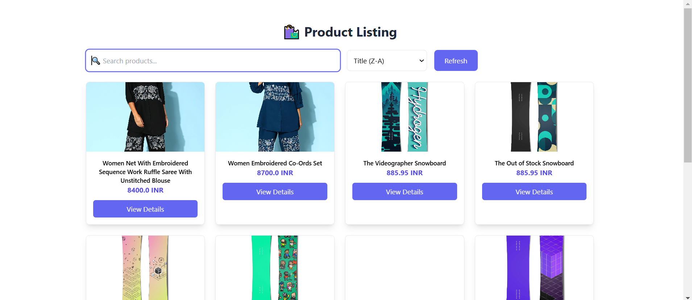
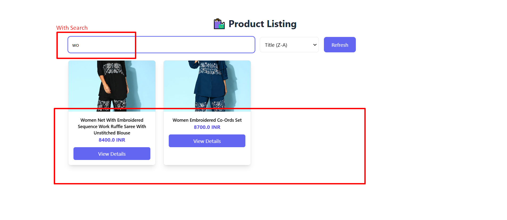
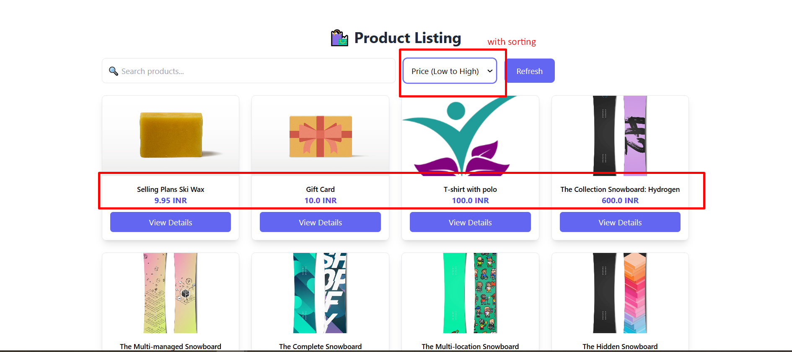
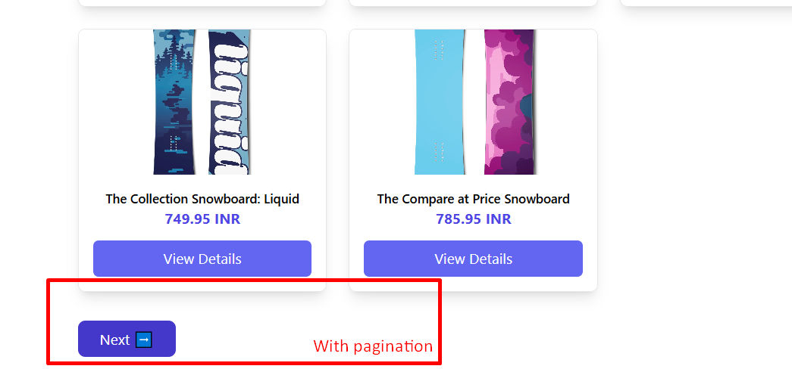

Here’s your updated `README.md` file based on your deployment setup and requirements:  

---

# **Shopify Storefront Task**  

## **Live Application**  
🔗 **Live URL:** [Shopify Storefront Task](https://shopify-storefront-task.onrender.com/)  

---

## **Project Overview**  
This is a Shopify storefront built with **React (frontend)** and **Node.js (backend)**.  
- The **frontend** is a React-based UI for displaying Shopify products.  
- The **backend** is a Node.js server that serves the frontend as static files and handles API requests.  
- **No database** is required for this project.  

---

## **Tech Stack**  
- **Frontend:** React, Vite, Material UI  
- **Backend:** Node.js, Express  
- **Hosting:** Render (Free Tier)  

---

## **Setup Instructions**  

### **1. Clone the Repository**  
```sh
git clone https://github.com/your-repo/shopify-storefront-task.git
cd shopify-storefront-task
```

### **2. Install Backend Dependencies**  
```sh
cd backend
npm install
```

### **3. Build the Frontend**  
```sh
cd frontend
npm install
npm run build
```
This generates a `build` folder inside the `frontend` directory.

### **4. Move Build Folder to Backend**  
```sh
mv frontend/build backend/build
```

### **5. Start the Backend Server**  
```sh
cd backend
node server.js
```
Server will run at `http://localhost:4000/`.

---

## **Deployment**  

### **Backend Deployment on Render**  
1. Push your code to **GitHub**.  
2. Go to [Render](https://render.com/) and create a free account.  
3. Click **New Web Service** → **Connect GitHub Repo**.  
4. Set **Build Command:**  
   ```sh
   npm install && npm run build
   ```  
5. Set **Start Command:**  
   ```sh
   node server.js
   ```  
6. Deploy and get the live app URL.  

---

## **Project Structure**  
```
shopify-storefront-task/
│── backend/  
│   ├── build/  # Contains frontend build  
│   ├── server.js  # Express server serving frontend & API  
│   ├── package.json  
│── frontend/  
│   ├── src/  
│   ├── public/  
│   ├── package.json  
│── README.md  
```

---

## **Assumptions & Considerations**  
- This app fetches products using Shopify's GraphQL API.  
- No authentication is required for users.  
- The frontend is statically served from the backend.  

---

## **Screenshots**  





---

## **Contact & Support**  
For any issues, create an issue in the repository or reach out via email.  